# 斯诺克大师国内App v1.0.0 — 测试点清单

> **项目背景**：当前已有海外版App，本项目为国内App开发。核心业务为用户在App内进行台球视频制作、精彩视频集锦制作。  
> **文档来源**：《斯诺克大师国内App v1.0.0 产品需求文档》（26页）  
> **生成日期**：2026-07-28

---

## 一、文档概述

### 1.1 测试范围

| 模块 | 功能 | 优先级 |
|------|------|--------|
| 1. 登录与认证 | 微信登录、苹果账号登录、游客模式、账号注销、数据同步 | P0 |
| 2. 视频本地制作 | 视频解锁、原片下载、本地制作、状态流转、失败处理、过期处理 | P0 |
| 3. 我的视频管理 | 视频列表、分类筛选、制作中视频、红点标识 | P0 |
| 4. 视频播放器 | 专业播放器、简单播放器、快捷操作、球谱/时间进度条、倍速 | P0 |
| 5. 支付 | 微信支付（安卓）、IAP支付（iOS）、视频券、退款 | P0 |
| 6. 交手记录 | 视频卡片、场卡片、横滑交互 | P1 |
| 7. 个人数据可视化 | 数据展示、评级卡片、进球率折线图、单杆高分 | P1 |
| 8. 分享 | 视频分享（微信/朋友圈/抖音）、个人数据长图分享、保存相册 | P1 |
| 9. 消息推送 | 极光推送、比赛结果通知、视频制作通知 | P1 |
| 10. 多语言 | 中文/英文文案 | P2 |
| 11. 埋点 | 事件埋点验证 | P1 |
| 12. 非功能需求 | 性能、兼容性、网络、安全 | P0 |

### 1.2 优先级定义

- **P0**：核心功能，阻塞发布
- **P1**：重要功能，影响用户体验
- **P2**：次要功能，可延期
- **P3**：优化项，锦上添花

---

## 二、业务背景与核心流程

### 2.1 核心业务流程

```
用户打开App → 微信/苹果登录 → 数据同步（小程序数据）
→ 查看交手记录/我的视频 → 解锁视频（用券/付费）
→ 原片下载 → 本地制作 → 观看/分享视频
```

### 2.2 国内版与海外版差异

| 对比项 | 国内版 | 海外版 |
|--------|--------|--------|
| 服务器 | 国内服务器 | 海外服务器 |
| 登录方式 | 微信 + 苹果账号 | 苹果账号 |
| 支付方式 | 微信支付（安卓）+ IAP（iOS） | 仅 IAP |
| 消息推送 | 极光推送（国内厂商） | 不支持 |
| 分享渠道 | 微信、朋友圈、抖音 | 不支持微信/抖音 |
| 包名 | 独立包名 | 独立包名 |

### 2.3 视频制作核心流程图

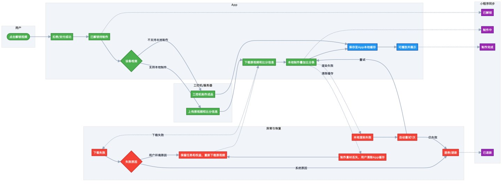

---

## 三、模块 1：登录与认证

### 3.1 功能范围

- 微信授权一键登录（Android + iOS）
- 苹果账号登录（iOS）
- 游客模式
- 账号注销
- 小程序 ↔ App 数据同步（UnionID 机制）

### 3.2 测试点

#### 3.2.1 微信登录

| 编号 | 标题 | 前置条件 | 操作步骤 | 预期结果 | 优先级 |
|------|------|---------|---------|---------|--------|
| TP-L-001 | 正常微信登录流程 | App 已安装，微信已安装且已登录 | 1. 打开 App 进入登录页 2. 点击"微信登录" 3. 微信弹出授权页 4. 点击"确认登录" | 登录成功，进入首页，自动同步小程序数据（比赛、个人、视频券、视频） | P0 |
| TP-L-002 | UnionID 关联已有小程序账号 | 微信下已绑定小程序账号 | 使用同一微信授权登录 App | 自动识别为同一用户，数据完全同步 | P0 |
| TP-L-003 | 新用户微信登录自动创建账号 | 微信账号未在系统中注册过 | 使用新微信授权登录 | 自动创建账号，同步微信昵称和头像 | P0 |
| TP-L-004 | 未同意隐私协议点击微信登录 | 用户未勾选隐私协议 | 点击"微信登录" | 气泡提示"请先阅读并同意隐私政策与用户协议"，不跳转微信 | P0 |
| TP-L-005 | 未安装微信 | 设备未安装微信 | 点击"微信登录" | Toast 提示"请先下载微信 App"，引导下载微信 | P0 |
| TP-L-006 | 用户无微信账号 | 微信已安装但用户未注册微信 | 点击"微信登录" | 微信内引导用户注册新账号 | P1 |
| TP-L-007 | 用户取消微信授权 | 微信授权页面弹出 | 点击"取消"或返回 | App 端提示"已取消微信授权"，停留在登录页 | P1 |
| TP-L-008 | 微信授权过期/无效 | 用户之前授权过但已过期 | 点击"微信登录" | Toast 提示"授权已过期，请重试" | P1 |
| TP-L-009 | 网络异常时微信登录 | 设备断网或弱网 | 点击"微信登录" | Toast 提示"网络异常，请检查后重试" | P0 |
| TP-L-010 | 后端接口超时 | 后端服务响应慢 | 点击"微信登录" | Toast 提示"加载超时，请稍后重试" | P1 |
| TP-L-011 | 微信 SDK 返回错误 | SDK 异常 | 点击"微信登录" | 显示对应的错误提示信息 | P1 |
| TP-L-012 | 多次快速点击微信登录按钮 | 登录页 | 连续多次点击"微信登录" | 不重复调起微信，防重复提交 | P2 |

**iOS 端登录页参考图**：

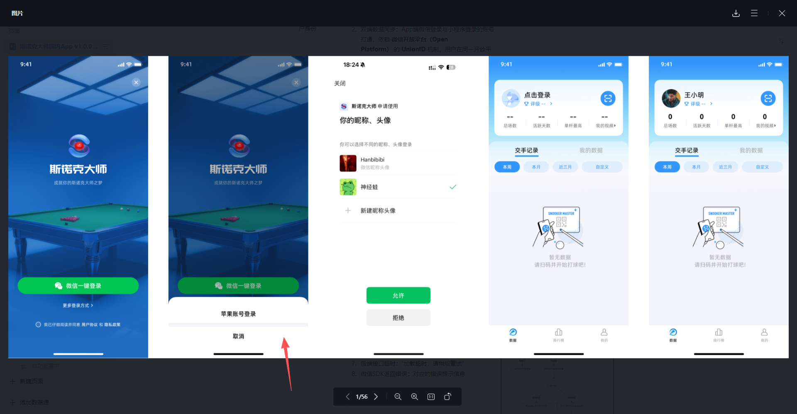

#### 3.2.2 苹果账号登录（iOS）

| 编号 | 标题 | 前置条件 | 操作步骤 | 预期结果 | 优先级 |
|------|------|---------|---------|---------|--------|
| TP-L-020 | 正常苹果账号登录 | iOS 设备，已注册苹果账号 | 1. 打开 App 进入登录页 2. 点击"苹果账号登录" 3. 授权确认 | 登录成功，使用苹果账号昵称与头像 | P0 |
| TP-L-021 | 苹果账号创建新账号 | 苹果账号未在系统中注册 | 使用苹果账号首次登录 | 自动创建新账号 | P0 |
| TP-L-022 | 苹果账号登录已有账号 | 苹果账号已注册过 | 使用苹果账号再次登录 | 直接登录，数据不变 | P0 |
| TP-L-023 | 未同意隐私协议点击苹果登录 | 未勾选隐私协议 | 点击"苹果账号登录" | 提示"请先阅读并同意隐私政策与用户协议" | P0 |

#### 3.2.3 数据同步

| 编号 | 标题 | 前置条件 | 操作步骤 | 预期结果 | 优先级 |
|------|------|---------|---------|---------|--------|
| TP-L-030 | 同步比赛数据 | 小程序有历史比赛记录 | 微信登录 App | 历史比赛列表、比赛成绩、比赛详情完整同步 | P0 |
| TP-L-031 | 同步个人数据 | 小程序有昵称、头像、俱乐部设置 | 微信登录 App | 昵称、头像、默认俱乐部设置同步 | P0 |
| TP-L-032 | 同步视频券数据 | 小程序有可用/已过期/已使用券 | 微信登录 App | 可用视频券列表、已过期&已使用视频券同步 | P0 |
| TP-L-033 | 同步视频数据 | 小程序有已解锁/制作中/已过期/制作失败视频 | 微信登录 App | 四种状态视频全部同步 | P0 |
| TP-L-034 | 大数据量同步性能 | 小程序有 500+ 场比赛、100+ 个视频 | 微信登录 App | 同步完成时间 < 5s，UI 不卡顿 | P1 |
| TP-L-035 | 同步中断恢复 | 登录过程中断网 | 断网后重新联网 | 数据最终一致性，不出现部分同步 | P1 |

#### 3.2.4 游客模式

| 编号 | 标题 | 前置条件 | 操作步骤 | 预期结果 | 优先级 |
|------|------|---------|---------|---------|--------|
| TP-L-040 | 进入游客模式 | 登录页 | 点击右上角关闭按钮 | 进入游客模式，所有页面显示空状态 | P1 |
| TP-L-041 | 游客模式触发登录 | 游客模式 | 点击需要登录的模块 | 弹出登录页 | P1 |
| TP-L-042 | 游客模式再次关闭登录页 | 游客模式弹出登录页 | 点击右上角关闭 | 回到游客模式空状态 | P2 |

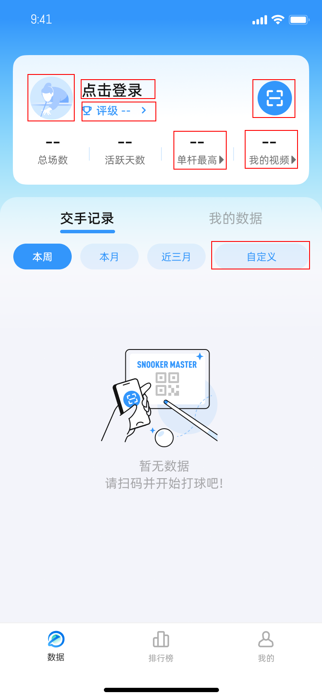

#### 3.2.5 账号注销

| 编号 | 标题 | 前置条件 | 操作步骤 | 预期结果 | 优先级 |
|------|------|---------|---------|---------|--------|
| TP-L-050 | 注销确认弹窗 | 已登录，进入注销页面 | 点击注销按钮 | 弹出一次确认弹窗 | P1 |
| TP-L-051 | 注销二次确认 | 已点击一次确认 | 点击确认 | 弹出二次确认"确认注销吗？您账号下的数据将被永久删除且不可恢复" | P1 |
| TP-L-052 | 确认注销 | 二次确认弹窗 | 点击确认 | 注销成功，回到游客模式，调起登录页 | P0 |
| TP-L-053 | 取消注销 | 任一确认弹窗 | 点击取消 | 弹窗关闭，不注销 | P1 |
| TP-L-054 | 小程序端同步注销状态 | App 端已注销 | 在小程序调用接口 | 返回"该账号已注销"的 toast，小程序刷新为未登录状态 | P1 |

> **注**：注销确认弹窗 UI 图需从 Figma 设计稿补充（PDF 中对应图片提取异常）

---

## 四、模块 2：视频本地制作（核心功能）

### 4.1 功能范围

- 视频解锁（用券 / 付费）
- 设备检测（判断是否支持本地制作）
- 原片下载（从腾讯云，最大并发 2 个）
- 本地视频制作（叠加比分条、头像、转场特效等）
- 状态流转：待解锁 → 已解锁 → 下载中 → 制作中 → 制作完成 / 失败
- 异常处理：下载失败、制作失败、自动重试、退券退款
- 过期处理：48h 未解锁、90d 未制作、缓存清除
- 与小程序状态同步

### 4.2 状态流转图


### 4.3 测试点

#### 4.3.1 视频解锁

| 编号 | 标题 | 前置条件 | 操作步骤 | 预期结果 | 优先级 |
|------|------|---------|---------|---------|--------|
| TP-V-001 | 用券解锁视频 | 用户有可用视频券 | 1. 进入场视频 tab 2. 点击"解锁视频" 3. 选择"视频券解锁" | 解锁成功，视频状态变为"下载中"，券数量-1 | P0 |
| TP-V-002 | 付费解锁视频（安卓） | 安卓设备，有余额 | 1. 点击"解锁视频" 2. 选择"现金解锁X元" 3. 完成微信支付 | 支付成功，视频状态变为"下载中"，通知工控机上传原视频切片 | P0 |
| TP-V-003 | 付费解锁视频（iOS） | iOS 设备 | 1. 点击"解锁视频" 2. 选择"现金解锁X元" 3. 完成 IAP 支付 | 支付成功，视频状态变为"下载中" | P0 |
| TP-V-004 | 解锁后视频封面变化 | 视频已解锁 | 查看我的视频列表 | 封面变为"下载中"状态，视频排到回放列表最前 | P0 |
| TP-V-005 | 解锁后小程序状态同步 | App 内解锁成功 | 在小程序查看该视频 | 显示"制作中，请至 App 内查看" | P0 |
| TP-V-006 | 用券解锁-券不足 | 用户无可用券 | 点击"视频券解锁" | 引导购买视频券或切换现金解锁 | P1 |
| TP-V-007 | 解锁权限校验-未登录 | 游客模式 | 尝试解锁视频 | 弹出登录页 | P0 |
| TP-V-008 | 解锁权限校验-券已过期 | 用户只有过期券 | 选择用券解锁 | 提示券已过期，引导购买 | P1 |
| TP-V-009 | 解锁并发限制 | 已有 2 个视频在下载中 | 解锁第 3 个视频 | 加入下载队列，等前面的完成后开始下载 | P1 |
| TP-V-010 | 相册权限授权 | 首次解锁视频 | 解锁成功时弹出相册权限请求 | 允许→制作完成后自动保存至相册；不允许→仅缓存至 App 本地 | P0 |

#### 4.3.2 设备检测与制作方式判断

| 编号 | 标题 | 前置条件 | 操作步骤 | 预期结果 | 优先级 |
|------|------|---------|---------|---------|--------|
| TP-V-010 | 满足本地制作条件 | 设备性能达标 | 点击解锁视频 | 走 App 本地制作流程 | P0 |
| TP-V-011 | 不满足本地制作条件 | 低版本手机/存储空间不足 | 点击解锁视频 | 自动切换为工控机制作流程 | P0 |
| TP-V-012 | 存储空间不足检测 | 设备存储空间 < 阈值 | 尝试解锁视频 | 提示存储空间不足，引导清理 | P1 |
| TP-V-013 | 内存不足检测 | 设备内存不足 | 尝试本地制作 | 切换为工控机制作 | P1 |
| TP-V-014 | iOS 最低版本检测 | iOS 版本低于最低要求 | 尝试本地制作 | 切换为工控机制作 | P1 |
| TP-V-015 | Android 最低版本检测 | Android 版本低于最低要求 | 尝试本地制作 | 切换为工控机制作 | P1 |

#### 4.3.3 原片下载

| 编号 | 标题 | 前置条件 | 操作步骤 | 预期结果 | 优先级 |
|------|------|---------|---------|---------|--------|
| TP-V-020 | 正常下载原片 | 已解锁视频，工控机已上传原片 | 解锁后自动开始下载 | 显示下载进度条，下载完成后自动进入制作流程 | P0 |
| TP-V-021 | 最大并发下载数 | 同时解锁多个视频 | 查看下载队列 | 最大 2 个同时下载，其余排队 | P1 |
| TP-V-022 | 下载任务优先级 | 有下载任务和制作任务同时存在 | 查看任务执行 | 下载任务优先于制作任务 | P1 |
| TP-V-023 | 网络断开下载中断 | 下载过程中断网 | 断开网络 | 暂停下载，显示下载中断状态 | P0 |
| TP-V-024 | 网络恢复自动重试 | 下载因网络中断 | 恢复网络 + App 在前台 | 自动静默重试，弹窗"你有 X 个制作中断的视频，是否继续制作？" | P0 |
| TP-V-025 | 杀掉 App 后恢复 | 下载过程中杀掉 App | 重新打开 App | 自动重试，弹窗提示继续制作 | P0 |
| TP-V-026 | 下载失败-文件丢失 | 原片文件从腾讯云丢失 | 下载时检测到文件不存在 | 视频显示下载失败，自动退券（返还有效期），或显示手动退款入口 | P0 |
| TP-V-027 | 下载失败-小程序同步 | App 内下载失败 | 在小程序查看该视频 | 显示"制作失败，请至 App 内查看" | P0 |

#### 4.3.4 本地视频制作

| 编号 | 标题 | 前置条件 | 操作步骤 | 预期结果 | 优先级 |
|------|------|---------|---------|---------|--------|
| TP-V-030 | 正常本地制作 | 原片下载成功，进入相关页面 | 进入首页/交手记录页/场详情页/我的视频页 | 自动检测并开始本地制作，显示制作进度条 | P0 |
| TP-V-031 | 制作触发页面 | 原片已上传 | 分别进入 4 个触发页面 | 进入任意一个页面都触发制作检测 | P1 |
| TP-V-032 | 制作完成-自动缓存 | 本地制作完成 | 制作完成后 | 成品视频自动缓存至 App 本地 | P0 |
| TP-V-033 | 制作完成-自动保存相册 | 相册权限已开启 | 本地制作完成 | 自动保存到用户相册 | P0 |
| TP-V-034 | 制作完成-小程序同步 | App 内制作完成 | 在小程序查看该视频 | 显示"制作成功，请至 App 内查看" | P0 |
| TP-V-035 | 制作中-预览原片 | 视频下载完成但制作未完成 | 点击"预览"按钮 | 进入横屏，使用简单播放器播放原片 | P0 |
| TP-V-036 | 30 分钟视频制作耗时 | 30 分钟原片 | 开始本地制作 | 制作时长 < 5 分钟 | P0 |
| TP-V-037 | 视频压缩处理 | 原片较大 | 本地制作 | 每分钟视频大小不超过规定 MB，压缩后 720P | P1 |
| TP-V-038 | 比分与画面对应 | 制作完成 | 播放成品视频 | 比分条与画面严格对应，成片与工控机成片效果一致 | P0 |

#### 4.3.5 本地制作失败

| 编号 | 标题 | 前置条件 | 操作步骤 | 预期结果 | 优先级 |
|------|------|---------|---------|---------|--------|
| TP-V-040 | 制作过程中 App 不在前台 | 制作进行中 | 切换到其他 App | 下次启动 App 时自动继续/重新制作，弹窗提示 | P0 |
| TP-V-041 | 素材/数据丢失导致失败 | 制作中素材丢失 | 继续制作 | 视频显示制作失败，自动退券或显示手动退款入口 | P0 |
| TP-V-042 | 制作失败-小程序同步 | App 内制作失败 | 在小程序查看 | 显示"制作失败，请至 App 内查看" | P0 |
| TP-V-043 | 制作中断恢复弹窗 | 有制作中断的视频 | 打开 App | 弹窗"你有 X 个制作中断的视频，是否继续制作？"，点击查看跳转到制作中视频页面 | P0 |
| TP-V-044 | 制作中断-点击暂不 | 弹窗出现 | 点击"暂不" | 弹窗关闭，视频保持中断状态 | P1 |

#### 4.3.6 视频过期

| 编号 | 标题 | 前置条件 | 操作步骤 | 预期结果 | 优先级 |
|------|------|---------|---------|---------|--------|
| TP-V-050 | 48h 未解锁过期 | 比赛结束 48h | 查看视频状态 | 视频显示"已过期" | P0 |
| TP-V-051 | 90d 未制作过期 | 原片下载后 90d 未制作 | 查看视频状态 | 视频显示"已过期" | P0 |
| TP-V-052 | 缓存清除过期 | 用户清理 App 缓存 | 查看视频状态 | 视频显示"已过期" | P0 |
| TP-V-053 | 过期状态-小程序同步 | App 内视频过期 | 在小程序查看 | 显示"已过期" | P0 |
| TP-V-054 | 过期后不可播放 | 视频已过期 | 点击播放 | 不可播放，引导重新购买（如有） | P1 |

#### 4.3.7 视频渲染内容验证

| 编号 | 标题 | 前置条件 | 操作步骤 | 预期结果 | 优先级 |
|------|------|---------|---------|---------|--------|
| TP-V-060 | 单杆视频渲染内容 | 单杆视频制作完成 | 播放视频 | 片头片尾、俱乐部名称、用户头像&昵称、实时比分条、斯诺克大师 logo | P0 |
| TP-V-061 | 局视频渲染内容 | 局视频制作完成 | 播放视频 | 同上 | P0 |
| TP-V-062 | 精彩集锦渲染内容 | 精彩集锦制作完成 | 播放视频 | 片头片尾、俱乐部名称、转场特效、【精彩集锦】字样、logo、每一杆厚薄度&杆速 | P0 |
| TP-V-063 | 失误集锦渲染内容 | 失误集锦制作完成 | 播放视频 | 片头片尾、俱乐部名称、转场特效、【失误集锦】字样、logo、每一杆厚薄度&杆速 | P0 |
| TP-V-064 | 成片与工控机对比 | 同一场比赛，App 和工控机各制作一次 | 对比两段视频 | 效果一致 | P0 |

### 4.4 UI 参考

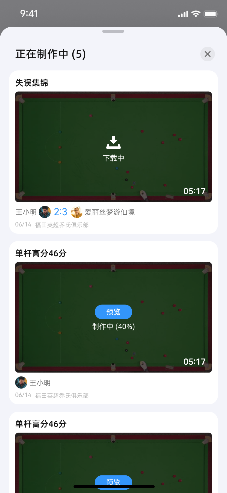

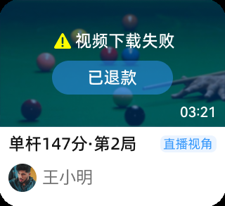

---

## 五、模块 3：我的视频管理

### 5.1 页面结构

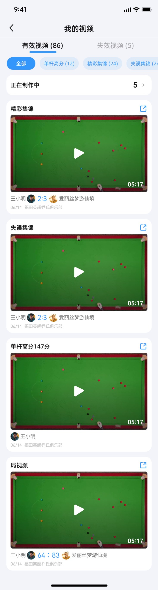

### 5.2 测试点

| 编号 | 标题 | 操作步骤 | 预期结果 | 优先级 |
|------|------|---------|---------|--------|
| TP-M-001 | 有效视频/失效视频 tab | 进入我的视频页 | 顶部两个 tab：有效视频(N) + 失效视频(M) | P0 |
| TP-M-002 | 分类筛选-全部 | 点击"全部" | 显示所有已制作成功的视频 | P0 |
| TP-M-003 | 分类筛选-单杆高分 | 点击"单杆高分(12)" | 仅显示单杆高分视频 | P0 |
| TP-M-004 | 分类筛选-精彩集锦 | 点击"精彩集锦(24)" | 仅显示精彩集锦 | P0 |
| TP-M-005 | 分类筛选-失误集锦 | 点击"失误集锦(24)" | 仅显示失误集锦 | P0 |
| TP-M-006 | 分类筛选-局视频 | 点击"局视频" | 仅显示局视频 | P0 |
| TP-M-007 | 分类数量显示 | 查看各分类标签 | 数量仅计算已制作成功的视频，不含制作中 | P0 |
| TP-M-008 | 正在制作中横幅 | 有视频在下载/制作中 | 顶部显示"正在制作中 5 >" | P0 |
| TP-M-009 | 点击进入制作中列表 | 点击"正在制作中"横幅 | 进入制作中视频列表页 | P0 |
| TP-M-010 | 页面上划交互 | 向上滑动页面 | 顶部标题栏、tab栏、分类栏固定在顶部 | P0 |
| TP-M-011 | 空状态 | 无任何视频 | 显示"快去交手记录解锁视频吧" | P1 |
| TP-M-012 | 视频卡片分享入口 | 点击视频卡片右上角分享图标 | 弹出分享弹窗 | P0 |
| TP-M-013 | 制作中视频-下载中 | 有视频正在下载 | 显示下载中状态及下载进度条 | P0 |
| TP-M-014 | 制作中视频-制作中 | 有视频正在制作 | 显示制作中状态及制作进度条 | P0 |
| TP-M-015 | 制作中视频-预览 | 视频下载完成但制作未完成 | 点击"预览" | 横屏，简单播放器播放原片 | P0 |
| TP-M-016 | 低版本手机状态 | 低版本手机观看 | 制作中视频页 | 无下载中/本地制作中状态，仅原工控机制作中状态 | P1 |
| TP-M-017 | 红点逻辑-本地制作完成 | App 本地制作完成未点击播放 | 查看视频卡片右下角 | 显示红点 | P0 |
| TP-M-018 | 红点逻辑-工控机制作完成 | 工控机制作完成未点击播放 | 查看视频卡片右下角 | 显示红点 | P1 |

---

## 六、模块 4：视频播放器

### 6.1 功能范围

- 简单播放器（预览用）
- 专业播放器（完整功能）
- 快捷操作（连点快进/快退、长按 2x 快进）
- 亮度/音量调节
- 球谱进度条 / 时间进度条
- 倍速播放（逐帧 ~ 2.0x）
- 设置（进度条形式切换、记忆）

### 6.2 UI 参考

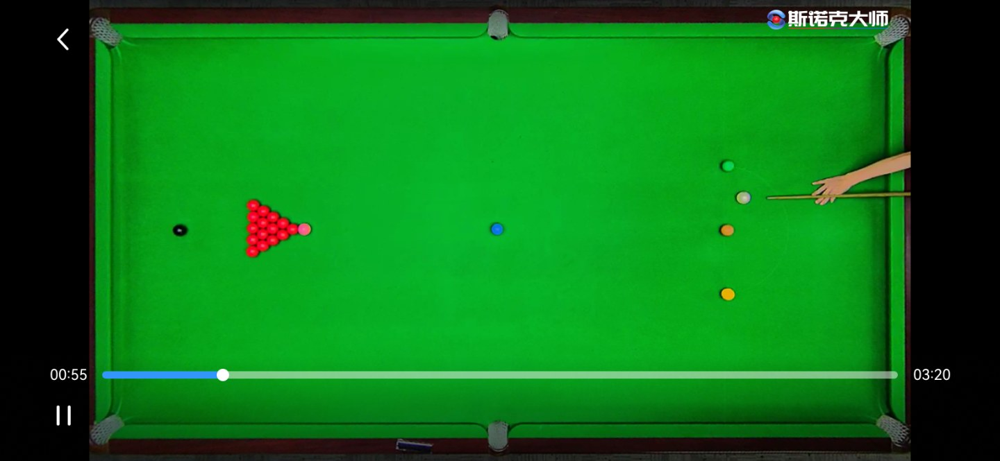

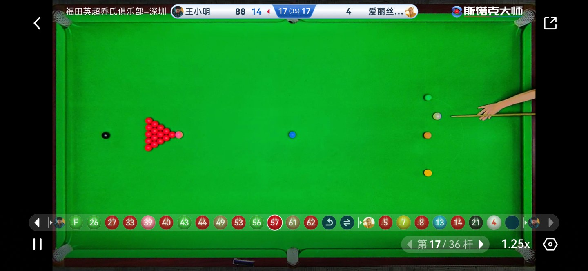

### 6.3 测试点

#### 6.3.1 播放器入口与引导

| 编号 | 标题 | 操作步骤 | 预期结果 | 优先级 |
|------|------|---------|---------|--------|
| TP-P-001 | 完整播放器入口 | 在我的视频/比赛记录中点击已制作完成的视频 | 横屏播放，进入完整专业播放器 | P0 |
| TP-P-002 | 简单播放器入口 | 在制作中视频页面点击"预览" | 横屏，使用简单播放器播放原片 | P0 |
| TP-P-003 | 首次进入引导页 | 第 1-2 次进入完整播放器 | 显示引导页面，展示快捷操作说明 | P0 |
| TP-P-004 | 引导页消失 | 引导页 | 点击屏幕任意位置 | 引导页消失，回到播放器默认状态 | P0 |
| TP-P-005 | 第 3 次进入无引导 | 第 3 次及以后进入播放器 | 直接进入播放器，无引导页 | P1 |

#### 6.3.2 快捷操作

| 编号 | 标题 | 操作步骤 | 预期结果 | 优先级 |
|------|------|---------|---------|--------|
| TP-P-010 | 连点快进至下一杆 | 播放中，在热点区域连点（0~1s 间隔） | 快进至下一杆，屏幕显示遮罩 1s 消失 | P0 |
| TP-P-011 | 连点快退至上一杆 | 播放中，反向连点 | 快退至上一杆，遮罩 1s 消失 | P0 |
| TP-P-012 | 已是第一杆 | 在第一杆时快退连点 | Toast 提示"已是第一杆" | P0 |
| TP-P-013 | 已是最后一杆 | 在最后一杆时快进连点 | Toast 提示"已是最后一杆" | P0 |
| TP-P-014 | 连点间隔 >1s | 间隔 >1s 的两次点击 | 不触发快进/快退 | P1 |
| TP-P-015 | 连点遮罩显示 | 连点操作后 | 屏幕显示遮罩，1s 后消失 | P0 |
| TP-P-016 | 长按 2.0x 快进 | 在热点区域长按 1.5s | 以 2.0 倍速快进，顶部显示"2.0x 快进中" | P0 |
| TP-P-017 | 松开取消快进 | 2.0x 快进中 | 松开手指 | 取消快进，提示消失，恢复 1.0x | P0 |
| TP-P-018 | 连点遮罩 UI | 连点操作 | 查看遮罩样式 | 与 UI 设计稿一致 | P2 |

#### 6.3.3 亮度/音量调节

| 编号 | 标题 | 操作步骤 | 预期结果 | 优先级 |
|------|------|---------|---------|--------|
| TP-P-020 | 左侧滑动调亮度 | 在屏幕左边热点区域上下滑动 | 显示亮度条，调整亮度 | P0 |
| TP-P-021 | 亮度条自动消失 | 调整亮度后 | 无操作 2s 后亮度条消失 | P0 |
| TP-P-022 | 右侧滑动调音量 | 在屏幕右边热点区域上下滑动 | 显示音量条，调整音量 | P0 |
| TP-P-023 | 音量条自动消失 | 调整音量后 | 无操作 2s 后音量条消失 | P0 |

#### 6.3.4 设置

| 编号 | 标题 | 操作步骤 | 预期结果 | 优先级 |
|------|------|---------|---------|--------|
| TP-P-030 | 点击设置图标 | 点击设置图标 | 从屏幕右侧弹出设置弹窗 | P0 |
| TP-P-031 | 球谱进度条切换 | 设置中选择"球谱" | 进度条切换为球谱形式，立即生效 | P0 |
| TP-P-032 | 时间进度条切换 | 设置中选择"时间" | 进度条切换为时间形式，立即生效 | P0 |
| TP-P-033 | 记忆上次选择 | 上次选择时间进度条 | 下次进入同一视频播放器 | 自动使用上次选择的进度条形式 | P1 |

#### 6.3.5 球谱进度条

| 编号 | 标题 | 操作步骤 | 预期结果 | 优先级 |
|------|------|---------|---------|--------|
| TP-P-040 | 球谱显示-局视频 | 播放局视频 | 显示甲乙双方、犯规、进球、自由球标记 | P0 |
| TP-P-041 | 球谱显示-单杆视频 | 播放单杆视频 | 按单杆球谱顺序排列 | P0 |
| TP-P-042 | 焦点球跟随 | 播放视频 | 进度条焦点球跟随当前播放位置 | P0 |
| TP-P-043 | 单击球跳转 | 点击进度条上的球 | 跳转到对应球位播放 | P0 |
| TP-P-044 | 按住球预览 | 按住球 2s | 显示画面预览 | P0 |
| TP-P-045 | 球谱超屏滑动 | 球谱长度超过一屏 | 左右滑动球谱 | 支持滑动查看 | P0 |
| TP-P-046 | 左右键导航 | 球谱超屏 | 点击两端左右键 | 滑动查看 | P0 |
| TP-P-047 | 焦点球自动回位 | 当前焦点球滑出屏幕 | 5s 无操作 | 自动返回当前播放的焦点球 | P1 |
| TP-P-048 | 不标注手动操作 | 查看球谱 | 不显示手动改分、换人、撤回操作 | P1 |

#### 6.3.6 时间进度条

| 编号 | 标题 | 操作步骤 | 预期结果 | 优先级 |
|------|------|---------|---------|--------|
| TP-P-050 | 按住拖动预览 | 在时间进度条上按住拖动 | 一直显示预览画面 | P0 |
| TP-P-051 | 松开跳转 | 松开手指 | 预览关闭，跳转到相应位置 | P0 |

#### 6.3.7 倍速播放

| 编号 | 标题 | 操作步骤 | 预期结果 | 优先级 |
|------|------|---------|---------|--------|
| TP-P-060 | 默认播放速度 | 进入播放器 | 默认 1.0x | P0 |
| TP-P-061 | 逐帧播放 | 选择"逐帧" | 逐帧播放 | P0 |
| TP-P-062 | 0.25x 倍速 | 选择 0.25x | 0.25 倍速播放 | P0 |
| TP-P-063 | 0.5x 倍速 | 选择 0.5x | 0.5 倍速播放 | P0 |
| TP-P-064 | 1.0x 倍速 | 选择 1.0x | 正常速度播放 | P0 |
| TP-P-065 | 1.5x 倍速 | 选择 1.5x | 1.5 倍速播放 | P0 |
| TP-P-066 | 2.0x 倍速 | 选择 2.0x | 2.0 倍速播放 | P0 |
| TP-P-067 | 倍速立即生效 | 切换倍速 | 选择后立即生效 | P0 |
| TP-P-068 | 重新进入重置倍速 | 切换倍速后退出 | 再次进入视频播放器 | 重置为 1.0x | P1 |

#### 6.3.8 播放器通用

| 编号 | 标题 | 操作步骤 | 预期结果 | 优先级 |
|------|------|---------|---------|--------|
| TP-P-070 | 控件显示/隐藏 | 点击屏幕空白处 | 控件消失，再次点击后出现 | P0 |
| TP-P-071 | 播放完自动回到开头 | 视频播放到结尾 | 自动回到开头重新播放 | P1 |
| TP-P-072 | 播放中切换倍速 UI | 播放中切换倍速 | UI 显示当前倍速 | P1 |

---

## 七、模块 5：支付（微信支付 + IAP）

### 7.1 功能范围

- 商品类型：一次性付费解锁视频、视频券套餐
- 安卓端：微信支付
- iOS 端：苹果 IAP 支付
- 退款：安卓端支持、iOS 端引导官方渠道
- 仅国内 App 支持，国外 App 不支持
- 后台状态同步

### 7.2 UI 参考


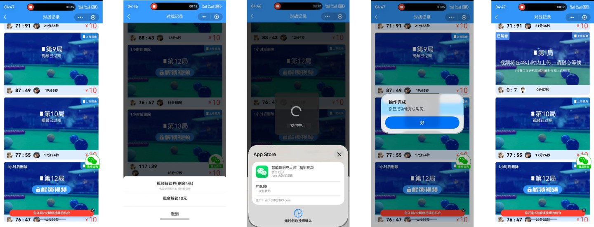

### 7.3 测试点

#### 7.3.1 视频付费解锁

| 编号 | 标题 | 操作步骤 | 预期结果 | 优先级 |
|------|------|---------|---------|--------|
| TP-PAY-001 | 视频定价-失误集锦≤5杆 | 查看失误集锦价格 | 1 元 | P0 |
| TP-PAY-002 | 视频定价-失误集锦≤15杆 | 查看失误集锦价格 | 3 元 | P0 |
| TP-PAY-003 | 视频定价-失误集锦>15杆 | 查看失误集锦价格 | 5 元 | P0 |
| TP-PAY-004 | 视频定价-局视频 | 查看局视频价格 | 10 元 | P0 |
| TP-PAY-005 | 视频定价-单杆<40分 | 查看单杆视频价格 | 3 元 | P0 |
| TP-PAY-006 | 视频定价-单杆40~50分 | 查看单杆视频价格 | 4 元 | P0 |
| TP-PAY-007 | 视频定价-单杆50~60分 | 查看单杆视频价格 | 5 元 | P0 |
| TP-PAY-008 | 视频定价-单杆60~70分 | 查看单杆视频价格 | 6 元 | P0 |
| TP-PAY-009 | 视频定价-单杆70~80分 | 查看单杆视频价格 | 7 元 | P0 |
| TP-PAY-010 | 视频定价-单杆80~90分 | 查看单杆视频价格 | 8 元 | P0 |
| TP-PAY-011 | 视频定价-单杆90~100分 | 查看单杆视频价格 | 9 元 | P0 |
| TP-PAY-012 | 视频定价-单杆100~110分 | 查看单杆视频价格 | 10 元 | P0 |
| TP-PAY-013 | 视频定价-单杆110~120分 | 查看单杆视频价格 | 12 元 | P0 |
| TP-PAY-014 | 视频定价-单杆130~140分 | 查看单杆视频价格 | 16 元 | P0 |
| TP-PAY-015 | 视频定价-单杆>140分 | 查看单杆视频价格 | 18 元 | P0 |
| TP-PAY-016 | 安卓端微信支付成功 | 安卓端，点击"现金解锁X元" | 完成微信支付 | 弹窗"解锁成功"，视频状态变为"下载中" | P0 |
| TP-PAY-017 | iOS 端 IAP 支付成功 | iOS 端，点击"现金解锁X元" | 完成 IAP 支付 | 弹窗"解锁成功"，视频状态变为"下载中" | P0 |
| TP-PAY-018 | 微信支付失败-已取消 | 支付页面点击取消 | 关闭弹窗，停留在当前页 | Toast 提示"支付已取消" | P0 |
| TP-PAY-019 | 微信支付失败-操作过快 | 短时间内多次发起支付 | 支付失败 | Toast 提示"操作过快，请稍候再试" | P1 |
| TP-PAY-020 | 微信支付失败-其他原因 | 支付异常 | 支付失败 | Toast 提示"支付失败" | P1 |
| TP-PAY-021 | iOS 支付失败-已取消 | iOS 端取消 IAP | 关闭弹窗 | Toast 提示"支付已取消" | P0 |
| TP-PAY-022 | iOS 支付失败-其他原因 | iOS 端支付异常 | 支付失败 | Toast 提示"支付失败" | P1 |
| TP-PAY-023 | 解锁入口可见性 | 进入场视频 tab | 查看"解锁视频"按钮 | 显示全部视频类型（精彩集锦、失误集锦、单杆、局视频） | P0 |

#### 7.3.2 视频券购买

| 编号 | 标题 | 操作步骤 | 预期结果 | 优先级 |
|------|------|---------|---------|--------|
| TP-PAY-030 | 视频券套餐-9.9元 | 进入视频券购买页 | 9.9 元套餐：3 张券，有效期 1 个月 | P0 |
| TP-PAY-031 | 视频券套餐-29.9元 | 进入视频券购买页 | 29.9 元套餐：12 张券，有效期 3 个月 | P0 |
| TP-PAY-032 | 视频券套餐-118.8元 | 进入视频券购买页 | 118.8 元套餐：60 张券，有效期 12 个月 | P0 |
| TP-PAY-033 | 购买入口 | 我的页面 | 查看视频券购买入口 | 显示购买入口 | P0 |
| TP-PAY-034 | 安卓端购买券-微信成功 | 安卓端购买视频券 | 完成微信支付 | Toast 提示"购买完成"，券数量刷新，【我的卡券】新增记录 | P0 |
| TP-PAY-035 | iOS 端购买券-IAP成功 | iOS 端购买视频券 | 完成 IAP | 同上 | P0 |
| TP-PAY-036 | 购买券支付失败 | 支付异常 | 支付失败 | 同视频购买失败的提示逻辑 | P0 |
| TP-PAY-037 | 我的卡券展示 | 购买成功后 | 查看【我的卡券】 | 显示购买的视频券 | P0 |

#### 7.3.3 退款

| 编号 | 标题 | 操作步骤 | 预期结果 | 优先级 |
|------|------|---------|---------|--------|
| TP-PAY-040 | 安卓端-视频退款入口 | 视频下载/制作失败 | 查看视频卡片 | 显示"退款"按钮 | P0 |
| TP-PAY-041 | 安卓端-点击退款 | 视频下载/制作失败，点击"退款" | 视频订单变为"申请退款"状态 | 按钮变为"已申请退款" | P0 |
| TP-PAY-042 | 安卓端-自动退款 | 用户发起退款且视频无 url | 后台检测 | 自动退款，订单变为"已退款"状态 | P0 |
| TP-PAY-043 | 安卓端-原路退款 | 退款成功 | 查看支付账户 | 退款原路返回 | P0 |
| TP-PAY-044 | 安卓端-视频券不支持退款 | 查看视频券退款 | 无退款入口 | 安卓端不支持视频券退款 | P1 |
| TP-PAY-045 | iOS 端-视频退款指引 | 视频下载/制作失败，点击"退款" | 进入退款方式介绍静态页面 | 显示退款指引 | P0 |
| TP-PAY-046 | iOS 端-退款建议48h内 | iOS 端视频解锁 48h 内 | 查看退款建议 | 响应结果为"不退款" | P0 |
| TP-PAY-047 | iOS 端-退款建议48h后无url | iOS 端视频解锁 48h 后，无视频 url | 查看退款建议 | 响应结果为"退款" | P0 |
| TP-PAY-048 | iOS 端-退款建议48h后有url | iOS 端视频解锁 48h 后，有视频 url | 查看退款建议 | 响应结果为"不退款" | P0 |
| TP-PAY-049 | iOS 端-官方退款状态同步 | 苹果官方退款后 | 查看后台订单记录 | 退款状态刷新 | P1 |
| TP-PAY-050 | iOS 端-视频券不退款 | iOS 端查看视频券退款 | 退款建议 | 均为"不退款" | P1 |

#### 7.3.4 后台状态同步

| 编号 | 标题 | 操作步骤 | 预期结果 | 优先级 |
|------|------|---------|---------|--------|
| TP-PAY-060 | App 购买记录同步至后台 | App 端购买视频 | 查看后台付费明细列表 | 同步显示，购买渠道为"App" | P0 |
| TP-PAY-061 | App 退款记录同步至后台 | App 端退款 | 查看后台付费明细列表 | 同步显示退款状态 | P0 |
| TP-PAY-062 | 后台新增购买渠道筛选 | 后台付费明细 | 查看筛选项 | 新增"购买渠道"筛选项（小程序/App） | P0 |
| TP-PAY-063 | 视频券购买记录同步 | App 端购买视频券 | 查看后台套餐明细 | 同步显示 | P0 |
| TP-PAY-064 | 历史数据购买渠道 | 查看历史购买记录 | 查看购买渠道字段 | 历史数据均为"小程序" | P1 |

---

## 八、模块 6：交手记录与视频卡片

### 8.1 UI 参考

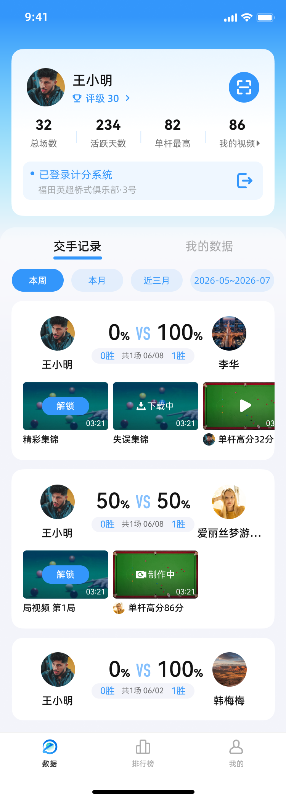

### 8.2 测试点

| 编号 | 标题 | 操作步骤 | 预期结果 | 优先级 |
|------|------|---------|---------|--------|
| TP-MR-001 | 交手卡片视频卡片展示 | 进入交手记录页 | 交手卡片下方新增横滑视频卡片 | P0 |
| TP-MR-002 | 视频卡片内容 | 查看视频卡片 | 显示与该对手最近一场比赛的视频回放 | P0 |
| TP-MR-003 | 展示的视频状态 | 查看视频卡片 | 展示：待解锁、已解锁视频（下载中/制作中待讨论） | P1 |
| TP-MR-004 | 不展示的状态 | 查看视频卡片 | 不展示：下载失败、制作失败、已过期的视频 | P1 |
| TP-MR-005 | 全部过期不展示 | 所有视频均已过期 | 查看交手卡片 | 不显示视频卡片 | P1 |
| TP-MR-006 | 视频卡片刷新时机 | 切换页面、切换 tab | 查看视频卡片 | 刷新数据 | P1 |
| TP-MR-007 | 视频展示顺序-状态优先级 | 查看视频卡片排序 | 待解锁视频 > 已解锁视频 | P1 |
| TP-MR-008 | 视频展示顺序-类型优先级 | 查看视频卡片排序 | 我的单杆高分 > 对手单杆高分 > 精彩集锦 > 失误集锦 > 局视频 | P1 |
| TP-MR-009 | 单杆高分排序 | 多条单杆高分 | 按分数顺序排列，相同分数按时间倒序 | P1 |
| TP-MR-010 | 局视频排序 | 多条局视频 | 按局序号顺序排列 | P1 |
| TP-MR-011 | 横滑交互 | 左右滑动视频列表 | 支持左右横滑 | P0 |
| TP-MR-012 | 最多展示 8 个 | 视频数量 >8 | 最大展示 8 个，超出显示"查看更多" | P1 |
| TP-MR-013 | 点击查看更多 | 点击"查看更多" | 进入最新一场比赛的视频列表页 | P1 |
| TP-MR-014 | 点击视频卡片 | 点击视频卡片 | 进入最新一场比赛的视频列表页 | P0 |
| TP-MR-015 | 场卡片-本场评级 | 进入交手详情页 | 查看场卡片 | 本场评级外显，⬆标识对应发挥超常/失常 | P1 |
| TP-MR-016 | 场卡片-头像评级 | 查看顶部交手卡片 | 头像处标记评级 | P1 |
| TP-MR-017 | 页面上划交互 | 上滑交手记录页 | 交手记录 & 我的数据 tab & 时间筛选器 | 滑动到顶部时固定 | P1 |

---

## 九、模块 7：个人数据可视化

### 9.1 UI 参考

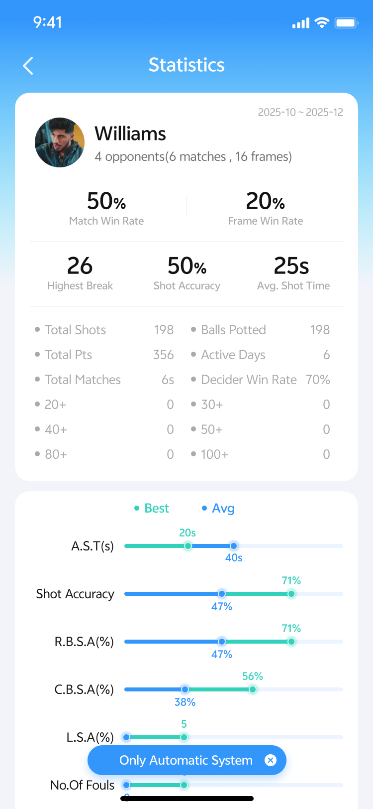


### 9.2 测试点

#### 9.2.1 首页个人卡片

| 编号 | 标题 | 操作步骤 | 预期结果 | 优先级 |
|------|------|---------|---------|--------|
| TP-PD-001 | 总场数展示 | 进入首页，查看个人卡片 | 显示历史总场数，不可点击 | P1 |
| TP-PD-002 | 活跃天数展示 | 查看个人卡片 | 显示历史总活跃天数，不可点击 | P1 |
| TP-PD-003 | 单杆最高 | 查看个人卡片 | 显示历史单杆最高分，点击进入单杆分页面 | P0 |
| TP-PD-004 | 我的视频数量 | 查看个人卡片 | 显示已解锁视频数量（不含下载中/制作中），点击进入我的视频页 | P0 |

#### 9.2.2 我的数据页入口

| 编号 | 标题 | 操作步骤 | 预期结果 | 优先级 |
|------|------|---------|---------|--------|
| TP-PD-010 | 点击我的头像 | 首页点击自己的头像 | 不跳转 | P0 |
| TP-PD-011 | 点击他人头像 | 点击他人头像 | 进入原个人数据页面（逻辑不变） | P0 |
| TP-PD-012 | 首页新增我的数据 tab | 查看首页 | 新增【我的数据】tab | P0 |
| TP-PD-013 | 点击进入我的数据页 | 点击【我的数据】tab | 进入我的数据可视化页面 | P0 |

#### 9.2.3 我的数据页-时间筛选

| 编号 | 标题 | 操作步骤 | 预期结果 | 优先级 |
|------|------|---------|---------|--------|
| TP-PD-020 | 筛选-本周 | 选择"本周" | 下方数据刷新，显示本周数据 | P0 |
| TP-PD-021 | 筛选-本月 | 选择"本月" | 显示本月数据 | P0 |
| TP-PD-022 | 筛选-近三月 | 选择"近三月" | 显示近三个自然月数据 | P0 |
| TP-PD-023 | 筛选-自定义 | 选择"自定义" | 按自定义时间范围显示数据（逻辑不变） | P1 |

#### 9.2.4 我的数据页-数据卡片

| 编号 | 标题 | 操作步骤 | 预期结果 | 优先级 |
|------|------|---------|---------|--------|
| TP-PD-030 | 总局数/总场数/交手人数 | 选择时间筛选 | 根据时间筛选变化 | P0 |
| TP-PD-031 | 我的评级卡片 | 查看我的评级 | 显示当前评级及能力图谱，不跟随时间筛选 | P0 |
| TP-PD-032 | 无评级空状态 | 用户无评级 | 查看评级卡片 | 显示空状态 | P1 |
| TP-PD-033 | 评级卡片点击跳转 | 点击评级卡片任意位置 | 进入我的评级页面 | P0 |
| TP-PD-034 | 进球率卡片 | 选择时间筛选 | 显示进球率（所选时间内每局进球率平均值，保留整数） | P0 |
| TP-PD-035 | 走位成功率 | 选择时间筛选 | 显示走位成功率（新增指标） | P0 |
| TP-PD-036 | 架杆成功率 | 选择时间筛选 | 显示架杆成功率（新增指标） | P0 |
| TP-PD-037 | 进球率折线图 | 查看折线图 | 根据所选时间以折线图展示进球率随时间变化 | P0 |
| TP-PD-038 | 折线图横轴-本周 | 筛选本周 | 横轴单位为天（显示为 6/8） | P0 |
| TP-PD-039 | 折线图横轴-1周~3个月 | 筛选 1 周~3 个月 | 横轴单位为周（显示为 6/20~6/26） | P0 |
| TP-PD-040 | 折线图横轴-3个月~12个月 | 筛选 3 个月~12 个月 | 横轴单位为月（显示为 6月、7月...） | P0 |
| TP-PD-041 | 折线图最多 6 个数据点 | 数据点 >6 | 左右横滑查看更多 | P1 |
| TP-PD-042 | 折线图中间节点无数据 | 某节点无数据 | 不显示数据点，显示横轴，前后数据点相连 | P1 |
| TP-PD-043 | 折线图仅开头/结尾有数据 | 仅一个数据 | 横轴显示对应时间及前后时间 | P1 |
| TP-PD-044 | 折线图点击无跳转 | 点击折线图 | 仅展示，不可点击 | P1 |
| TP-PD-045 | 单杆高分卡片 | 选择时间筛选 | 显示所选时间内的单杆最高分（最左侧） | P0 |
| TP-PD-046 | 单杆高分分栏 | 查看分栏 | 20+、30+、40+、50+、80+、100+ 六栏 | P0 |
| TP-PD-047 | 单杆高分数量 | 查看每栏下方 | 显示对应数量（如 20+ 为 20~29 分的单杆分数量） | P0 |
| TP-PD-048 | 仅记录 >20 的单杆分 | 查看单杆分 | < 20 的不记录 | P1 |
| TP-PD-049 | 无数据显示"--" | 某数据项无数据 | 显示"--" | P0 |
| TP-PD-050 | 颜色区分 | 查看折线图/评级/单杆分 | 不同颜色区分不同进球率、评级、单杆分 | P1 |

---

## 十、模块 8：分享

### 10.1 UI 参考

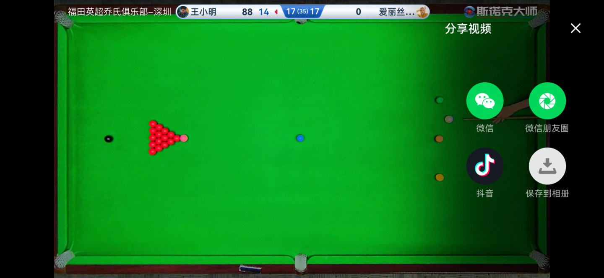

### 10.2 测试点

#### 10.2.1 成品视频分享

| 编号 | 标题 | 操作步骤 | 预期结果 | 优先级 |
|------|------|---------|---------|--------|
| TP-S-001 | 视频分享入口-播放器 | 在视频播放器中 | 点击分享按钮 | 弹出分享弹窗 | P0 |
| TP-S-002 | 视频分享入口-我的视频 | 在我的视频页 | 点击视频卡片分享图标 | 弹出分享弹窗 | P0 |
| TP-S-003 | 分享到微信好友 | 分享弹窗 | 选择"微信好友" | 分享成功 | P0 |
| TP-S-004 | 分享到朋友圈 | 分享弹窗 | 选择"朋友圈" | 跳转至动态编辑页面 | P0 |
| TP-S-005 | 分享到抖音 | 分享弹窗 | 选择"抖音" | 跳转至抖音作品编辑页面 | P0 |
| TP-S-006 | 抖音分享完成 | 分享到抖音后 | 查看弹窗 | 弹窗提示"已发布"，可选回到斯诺克大师 or 留在抖音 | P0 |
| TP-S-007 | 保存至相册 | 分享弹窗 | 选择"保存至相册" | 根据相册权限状态处理 | P0 |
| TP-S-008 | 保存相册-用户拒绝 | 相册权限被拒绝 | 保存时 | 弹窗提示"无相册权限，请至设置中开启" | P0 |
| TP-S-009 | 保存相册-用户同意 | 相册权限开启 | 保存后 | 提示"已保存至相册" | P0 |
| TP-S-010 | 分享内容-视频文件 | 分享视频 | 检查分享内容 | 直接分享制作好的视频文件，不分享在线链接 | P0 |

#### 10.2.2 个人数据长图分享

| 编号 | 标题 | 操作步骤 | 预期结果 | 优先级 |
|------|------|---------|---------|--------|
| TP-S-010 | 长图分享入口 | 我的数据页面 | 点击【分享】按钮 | 弹出分享弹窗 | P0 |
| TP-S-011 | 长图-分享微信好友 | 选择"微信好友" | 调用微信 SDK，选择目标场景 | 分享成功，弹窗"已分享" | P0 |
| TP-S-012 | 长图-分享朋友圈 | 选择"朋友圈" | 调用微信 SDK | 同上 | P0 |
| TP-S-013 | 长图-分享后选择 | 分享后 | 查看弹窗 | 可选回到斯诺克大师 or 留在微信 | P0 |
| TP-S-014 | 长图-保存相册 | 选择"保存至相册" | 根据权限处理 | 同视频保存逻辑 | P0 |

---

## 十一、模块 9：消息推送

### 11.1 UI 参考


### 11.2 测试点

| 编号 | 标题 | 操作步骤 | 预期结果 | 优先级 |
|------|------|---------|---------|--------|
| TP-N-001 | 极光推送接入 | App 启动 | 接入极光推送 | 推送流程跑通 | P0 |
| TP-N-002 | 通知权限请求 | 首次安装 App 并打开 | 系统弹出通知权限请求 | 询问是否允许 App 通知 | P0 |
| TP-N-003 | 通知权限-允许 | 用户允许通知 | 后续推送正常接收 | 正常接收推送 | P0 |
| TP-N-004 | 通知权限-拒绝 | 用户拒绝通知 | 后续不接收推送 | 不推送，引导去设置开启 | P1 |
| TP-N-005 | 推送时机 | App 不在前台时 | 事件发生 | 进行消息推送 | P0 |
| TP-N-006 | 比赛结果通知 | 一场比赛结束 | App 不在前台 | 收到通知，标题"比赛结果通知"，内容"比赛结束，点击查看详情" | P0 |
| TP-N-007 | 比赛通知点击跳转 | 点击比赛结果通知 | 查看跳转 | 跳转到场详情页-视频回放 tab | P0 |
| TP-N-008 | 视频制作成功通知-单杆 | 单杆视频制作成功 | App 不在前台 | 收到通知"单杆XX分视频已制作完成" | P0 |
| TP-N-009 | 视频制作成功通知-集锦 | 精彩/失误集锦制作成功 | App 不在前台 | 收到对应通知 | P0 |
| TP-N-010 | 视频制作成功通知-局视频 | 局视频制作成功 | App 不在前台 | 收到"局视频已制作完成" | P0 |
| TP-N-011 | 制作成功通知点击跳转 | 点击制作成功通知 | 查看跳转 | 跳转到我的视频页面并打开视频，横屏播放 | P0 |
| TP-N-012 | 视频制作失败通知-单杆 | 单杆视频制作失败 | App 不在前台 | 收到通知"单杆XX分视频制作失败" | P0 |
| TP-N-013 | 视频制作失败通知-集锦 | 集锦制作失败 | App 不在前台 | 收到对应通知 | P0 |
| TP-N-014 | 制作失败通知点击跳转 | 点击制作失败通知 | 查看跳转 | 跳转到我的视频-失效视频页面 | P0 |
| TP-N-015 | 厂商推送-华为 | 华为设备，App 不在前台 | 事件触发 | 通过华为推送通道接收 | P1 |
| TP-N-016 | 厂商推送-小米 | 小米设备 | 事件触发 | 通过小米推送通道接收 | P1 |
| TP-N-017 | 厂商推送-OPPO | OPPO 设备 | 事件触发 | 通过 OPPO 推送通道接收 | P1 |
| TP-N-018 | 厂商推送-vivo | vivo 设备 | 事件触发 | 通过 vivo 推送通道接收 | P1 |
| TP-N-019 | iOS 推送 | iOS 设备 | 事件触发 | 通过 APNs 接收 | P1 |
| TP-N-020 | 仅国内 App 支持 | 海外 App | 检查推送功能 | 不支持推送 | P1 |

---

## 十二、模块 10：多语言

| 编号 | 标题 | 操作步骤 | 预期结果 | 优先级 |
|------|------|---------|---------|--------|
| TP-ML-001 | 中文文案 | 切换系统语言为中文 | App 所有文案为中文 | P0 |
| TP-ML-002 | 英文文案 | 切换系统语言为英文 | App 所有文案为英文（按 Figma 设计稿） | P0 |
| TP-ML-003 | 新增功能英文文案 | 新功能页面 | 查看英文文案 | 与 Figma 设计稿一致 | P0 |
| TP-ML-004 | 同时适用国内/海外 | 国内 App | 查看多语言 | 如文档无特别标注，均同时适用 | P1 |

---

## 十三、模块 11：埋点

### 11.1 新增埋点事件清单

| 编号 | 事件名 | 触发时机 | 上报属性 | 对应业务指标 | 优先级 |
|------|--------|---------|---------|------------|--------|
| TP-ET-001 | user_signup | 安装后首次启动并完成登录 | signup_channel: wechat | App 激活率 | P0 |
| TP-ET-002 | user_login | 每次登录成功（除首次外） | login_method: wechat | App 登录次数 | P1 |
| TP-ET-003 | player_videocard | 点击交手卡片-视频卡片 | 无 | 曝光点击率 | P1 |
| TP-ET-004 | match_videocard | 点击场卡片-视频卡片 | 无 | 曝光点击率 | P1 |
| TP-ET-005 | video_unlock_start | 解锁视频成功时（券/现金） | unlock_type, video_price, video_type | 视频解锁率 | P0 |
| TP-ET-006 | video_unlock_success | 解锁成功进入下载时 | unlock_type, video_type, video_id | 视频解锁率 | P0 |
| TP-ET-007 | origin_download_success | 原片下载成功 | video_type, video_id | 下载转化 | P0 |
| TP-ET-008 | origin_download_fail | 原片下载失败 | video_type, video_id, fail_reason | 下载转化 | P0 |
| TP-ET-009 | local_make_start | 本地制作开始 | video_type, video_id, device_info | 制作效率 | P0 |
| TP-ET-010 | local_make_success | 本地制作成功 | video_type, video_id, device_info, make_duration | 制作效率 | P0 |
| TP-ET-011 | local_make_fail | 本地制作失败 | video_type, video_id, device_info, make_duration, fail_reason | 制作效率 | P0 |
| TP-ET-012 | video_play | 成品视频播放（每次） | video_type, video_id | 视频使用率 | P0 |
| TP-ET-013 | video_share | 分享动作完成 | channel, video_type, video_id | 视频分享率 | P0 |

### 11.2 埋点验证测试点

| 编号 | 标题 | 操作步骤 | 预期结果 | 优先级 |
|------|------|---------|---------|--------|
| TP-ET-020 | user_signup 上报时机 | 首次安装 App 并完成登录 | 查看埋点后台 | 上报一次，signup_channel=wechat | P0 |
| TP-ET-021 | user_login 不上报首次 | 首次登录 | 查看埋点 | 不上报 user_login（已在 signup 中） | P1 |
| TP-ET-022 | user_login 上报后续 | 第二次及以后登录 | 查看埋点 | 每次登录都上报 | P1 |
| TP-ET-023 | video_unlock_start 上报 | 用券/付费解锁成功 | 查看埋点 | 上报 unlock_type、video_price、video_type | P0 |
| TP-ET-024 | unlock_type 区分 | 分别用券和现金解锁 | 查看埋点 | 0=活动券, 1=套餐券, 2=付费 | P0 |
| TP-ET-025 | origin_download_success | 原片下载成功 | 查看埋点 | 上报 video_type, video_id | P0 |
| TP-ET-026 | origin_download_fail | 原片下载失败 | 查看埋点 | 上报 fail_reason（0=我方, 1=用户杀App） | P0 |
| TP-ET-027 | local_make_duration | 本地制作成功 | 查看埋点 | make_duration 字段有值 | P1 |
| TP-ET-028 | video_play 每次播放 | 播放同一视频 3 次 | 查看埋点 | 上报 3 次 | P1 |
| TP-ET-029 | video_share channel | 分别分享到微信/朋友圈/抖音/相册 | 查看埋点 | channel: 1=好友, 2=朋友圈, 3=抖音, 4=相册 | P0 |

---

## 十四、计分系统二维码

| 编号 | 标题 | 操作步骤 | 预期结果 | 优先级 |
|------|------|---------|---------|--------|
| TP-QR-001 | App 扫码登录计分系统 | 使用 App 扫描计分系统二维码 | 登录成功 | P0 |
| TP-QR-002 | 微信扫码登录计分系统 | 使用微信扫码登录计分系统 | 登录成功（现有逻辑不变） | P0 |
| TP-QR-003 | 登录状态同步 | App 扫码登录计分系统后 | 查看 App 端 | 登录状态同步至 App | P0 |
| TP-QR-004 | 退出状态同步 | App 退出计分系统 | 查看 App 端 | 退出状态同步 | P1 |
| TP-QR-005 | 不支持其他应用扫码 | 使用非 App/微信的应用扫描 | 扫描二维码 | 不支持 | P1 |
| TP-QR-006 | 不支持 App 扫其他二维码 | 使用 App 扫描非计分系统二维码 | 扫描 | 不支持（现有逻辑） | P1 |

---

## 十五、非功能需求

### 15.1 性能测试

| 编号 | 标题 | 测试方法 | 预期结果 | 优先级 |
|------|------|---------|---------|--------|
| TP-NF-001 | 30 分钟视频制作耗时 | 使用最低配置设备制作 30 分钟原片 | 制作时长 < 5 分钟 | P0 |
| TP-NF-002 | 带比分条视频每分钟制作时间 | 统计每分钟制作耗时 | ≤ X 分钟（需技术评估确定） | P1 |
| TP-NF-003 | 不带比分条视频每分钟制作时间 | 统计每分钟制作耗时 | ≤ X 分钟 | P1 |
| TP-NF-004 | 登录响应时间 | 登录接口 | 响应 < 3s | P0 |
| TP-NF-005 | 视频下载速度 | 下载 100MB 原片 | 下载速度 ≥ X MB/s | P1 |
| TP-NF-006 | 页面加载速度 | 进入各页面 | 加载 < 2s | P1 |
| TP-NF-007 | 并发制作性能 | 10 万视频/月的量级 | 系统不崩溃，制作成功率 > 95% | P1 |
| TP-NF-008 | 个人数据查询速度 | 有大量历史数据时查询 | 响应 < 3s | P1 |
| TP-NF-009 | 内存占用 | 长时间使用 App | 内存不泄漏，OOM 率 < 0.1% | P0 |

### 15.2 兼容性测试

| 编号 | 标题 | 测试范围 | 预期结果 | 优先级 |
|------|------|---------|---------|--------|
| TP-NF-010 | iOS 最低版本 | 测试 iOS 最低要求版本 | 正常运行 | P0 |
| TP-NF-011 | iOS 最新版本 | 测试最新 iOS | 正常运行 | P0 |
| TP-NF-012 | Android 最低版本 | 测试 Android 最低要求版本 | 正常运行 | P0 |
| TP-NF-013 | Android 主流版本 | Android 10/11/12/13/14 | 正常运行 | P0 |
| TP-NF-014 | 主流机型覆盖 | 华为/小米/OPPO/vivo/三星/苹果 | 各机型功能正常 | P0 |
| TP-NF-015 | 不同屏幕尺寸 | 小屏/大屏/折叠屏 | UI 正常显示 | P1 |
| TP-NF-016 | 不同网络环境 | WiFi/4G/5G/弱网 | 功能正常，弱网有合理提示 | P0 |
| TP-NF-017 | 存储空间不足 | 设备存储接近满 | 合理提示，不崩溃 | P1 |

### 15.3 网络异常

| 编号 | 标题 | 测试方法 | 预期结果 | 优先级 |
|------|------|---------|---------|--------|
| TP-NF-020 | 断网操作 | 各页面断网 | 不崩溃，合理提示 | P0 |
| TP-NF-021 | 弱网加载 | 限速 100KB/s | 有 loading，不超时崩溃 | P1 |
| TP-NF-022 | 网络切换 | WiFi ↔ 移动数据 | 不中断，自动恢复 | P1 |
| TP-NF-023 | 飞行模式 | 开启飞行模式 | 合理提示 | P1 |

### 15.4 安全测试

| 编号 | 标题 | 测试方法 | 预期结果 | 优先级 |
|------|------|---------|---------|--------|
| TP-NF-030 | Token 安全性 | 抓包查看登录响应 | Token 加密传输 | P0 |
| TP-NF-031 | 支付安全性 | 抓包查看支付请求 | 金额/商品信息加密 | P0 |
| TP-NF-032 | 视频防下载 | 尝试从 App 外部获取视频文件 | 视频文件加密，无法直接下载 | P1 |
| TP-NF-033 | 隐私协议 | 未同意隐私协议 | 不允许登录 | P0 |
| TP-NF-034 | 注销数据删除 | 账号注销后 | 验证数据已删除 | P0 |

### 15.5 异常场景

| 编号 | 标题 | 测试方法 | 预期结果 | 优先级 |
|------|------|---------|---------|--------|
| TP-NF-040 | App 崩溃恢复 | 制作/下载过程中 App 崩溃 | 重新打开后自动恢复 | P0 |
| TP-NF-041 | 电话打断 | 播放视频时来电 | 视频暂停，挂断后可继续 | P1 |
| TP-NF-042 | 后台切换 | 播放视频时切换到后台 | 暂停播放 | P1 |
| TP-NF-043 | 低电量模式 | 低电量时进行视频制作 | 提示用户或自动降低质量 | P2 |
| TP-NF-044 | 多设备同时登录 | 同一账号在多台设备登录 | 数据一致性，不出现冲突 | P1 |

---

## 十六、回归测试矩阵

### 16.1 与小程序的数据一致性

| 编号 | 测试点 | 预期结果 |
|------|--------|---------|
| TP-R-001 | 小程序解锁的视频在 App 显示 | 状态一致 |
| TP-R-002 | App 解锁的视频在小程序显示 | 状态同步 |
| TP-R-003 | 小程序购买的券在 App 显示 | 数量一致 |
| TP-R-004 | App 购买的券在小程序显示 | 数量同步 |
| TP-R-005 | 小程序制作的视频在 App 播放 | 正常播放 |
| TP-R-006 | App 制作的视频在小程序显示 | 显示对应状态 |

### 16.2 海外版回归

| 编号 | 测试点 | 预期结果 |
|------|--------|---------|
| TP-R-010 | 海外版不受国内版改动影响 | 功能正常 |
| TP-R-011 | 海外版不使用微信支付 | 仅 IAP |
| TP-R-012 | 海外版不使用极光推送 | 无推送功能 |
| TP-R-013 | 海外版不分享微信/抖音 | 不支持 |

---

## 十七、测试点统计

| 模块 | 测试点数量 | P0 | P1 | P2 |
|------|-----------|-----|-----|-----|
| 1. 登录与认证 | 28 | 14 | 11 | 3 |
| 2. 视频本地制作 | 44 | 26 | 14 | 4 |
| 3. 我的视频管理 | 18 | 10 | 6 | 2 |
| 4. 视频播放器 | 43 | 18 | 17 | 8 |
| 5. 支付 | 35 | 15 | 15 | 5 |
| 6. 交手记录 | 17 | 3 | 11 | 3 |
| 7. 个人数据可视化 | 26 | 7 | 12 | 7 |
| 8. 分享 | 14 | 7 | 4 | 3 |
| 9. 消息推送 | 20 | 7 | 9 | 4 |
| 10. 多语言 | 4 | 3 | 0 | 1 |
| 11. 埋点 | 18 | 8 | 7 | 3 |
| 12. 计分系统二维码 | 6 | 1 | 3 | 2 |
| 13. 非功能需求 | 25 | 5 | 12 | 8 |
| 14. 回归测试 | 12 | 0 | 12 | 0 |
| **合计** | **310** | **124** | **133** | **53** |

---

## 附录：图片索引

| 页面 | 图片 | 对应模块 |
|------|------|---------|
| 第 4 页 | iOS 登录页 UI（微信一键登录 + 隐私协议） | 登录与认证 |
| 第 6 页 | 游客模式 UI（点击登录 + 暂无数据） | 登录与认证 |
| 第 6 页 | 注销确认弹窗 UI（需从 Figma 补充） | 登录与认证 |
| 第 8 页 | 视频制作流程图、制作中视频页 | 视频本地制作 |
| 第 8-9 页 | 视频状态卡片（6 种状态） | 视频本地制作 |
| 第 10 页 | 视频成片示例 UI | 我的视频 |
| 第 11 页 | 我的视频页 UI | 我的视频 |
| 第 12 页 | 简单/专业播放器 UI | 播放器 |
| 第 13-14 页 | 播放器操作 UI（倍速、进度条等） | 播放器 |
| 第 15-17 页 | 支付流程 UI | 支付 |
| 第 18 页 | 交手记录视频卡片 UI | 交手记录 |
| 第 19-20 页 | 个人数据可视化 UI | 个人数据 |
| 第 22 页 | 分享 UI | 分享 |
| 第 23-24 页 | 推送通知 UI | 消息推送 |
